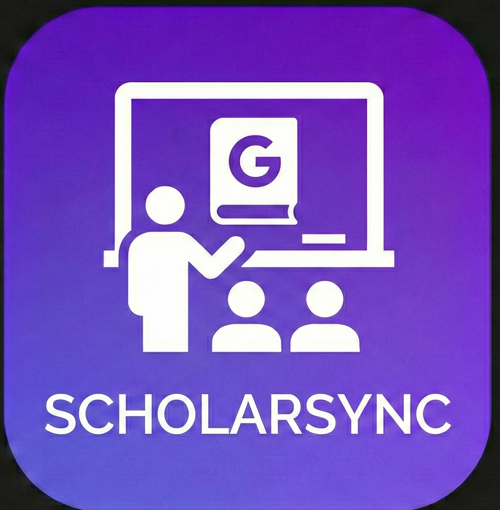

# 🎓 ScholarSync - AI Classroom Manager

<div align="center">



**The Ultimate AI-Powered Google Classroom Assistant**

[](https://scholarsync.vercel.app)
[](https://react.dev)
[](https://nodejs.org)
[](https://mongodb.com)
[](https://tailwindcss.com)

</div>

---

## 📖 About

**ScholarSync** is an AI-powered classroom management tool that seamlessly integrates with Google Classroom to help students excel in their coursework. It uses advanced AI models to explain concepts, generate quizzes, create flashcards, and draft solutions for assignments.

---

## ✨ Features - Detailed Overview

### 🔗 Google Classroom Sync
Seamlessly connect your Google account to automatically fetch:
- **All your enrolled courses** with names and section info
- **Assignments** with titles, descriptions, due dates, and point values
- **Attached materials** including PDFs, Google Docs, Slides, and links
- **Submission status** (turned in, missing, assigned)
- **Real-time refresh** - Pull latest data anytime with one click

### 🧠 AI-Powered Explanations
Get comprehensive explanations for any assignment:
- **Concept breakdown** - AI analyzes the assignment and explains each topic
- **Key formulas** - Important equations with explanations
- **Examples** - Practical examples to understand concepts
- **Common mistakes** - Things students often get wrong
- **Study tips** - How to approach similar problems

### 📝 Smart Quiz Generator
Turn any assignment into a practice quiz:
- **Customizable difficulty** - Easy, Medium, or Hard
- **Question types** - MCQ, Short Answer, True/False, or Mixed
- **Adjustable count** - Choose 5 to 20 questions
- **Instant feedback** - See correct answers with explanations
- **Score tracking** - Know how well you're doing
- **Regenerate** - Get a fresh set of questions anytime

### 🃏 AI Flashcard Creator
Automatically generate study flashcards:
- **Key terms** - Important vocabulary with definitions
- **Concepts** - Core ideas explained simply
- **Formulas** - Mathematical/scientific expressions
- **Flip to reveal** - Interactive card interface
- **Category tags** - Organized by topic
- **10-15 cards** per assignment for focused revision

### 💬 Chat with Documents
Have an interactive conversation with your assignment:
- **Ask anything** - "Explain question 3", "What formula do I need?"
- **Context-aware** - AI knows your entire assignment content
- **Figure understanding** - AI can describe images/diagrams in your PDFs
- **Streaming responses** - See answers appear in real-time
- **Chat history** - Conversations are saved per assignment
- **Clear chat** - Start fresh whenever needed

### ✍️ Rich Text Solution Editor
Draft and refine your solutions with a full-featured editor:
- **AI-generated drafts** - Get a complete solution as starting point
- **TipTap editor** - Professional rich text editing
- **Formatting options**:
  - Bold, Italic, Underline, Strikethrough
  - Headings (H1, H2, H3)
  - Bullet lists and numbered lists
  - Text alignment (left, center, right, justify)
  - Font family selection
  - Text colors
  - Links and images
- **Edit freely** - Modify AI-generated content to your style
- **Regenerate** - Get a new draft if needed

### 📤 Submit to Google Classroom
Submit directly without leaving the app:
- **Create Google Doc** - Converts your solution to a Google Doc
- **Auto-attach** - Links the Doc to your assignment submission
- **Organized folders** - Saves to `ScholarSync/CourseName/AssignmentName`
- **One-click submit** - Turns in to Google Classroom instantly
- **Version control** - Multiple drafts are saved separately

### 📁 Smart Google Drive Organization
Automatic file management:
```
My Drive/
└── ScholarSync/
    ├── Course 1/
    │   ├── Assignment 1 - Solution.docx
    │   └── Assignment 2 - Solution.docx
    └── Course 2/
        └── Assignment 1 - Solution.docx
```
- **Auto-create folders** - Creates course folders if they don't exist
- **Consistent naming** - Easy to find your work later
- **No manual organization** - Everything is sorted automatically

### 📄 PDF & Document Extraction
Advanced content extraction from attachments:
- **PDF parsing** - Extracts text from PDF files
- **Vision AI** - Uses LLaMA 4 Scout to describe images/diagrams
- **Google Docs** - Reads content from linked Docs
- **Figure descriptions** - AI describes charts, graphs, and diagrams
- **Multi-file support** - Select which attachment to focus on

### 🔑 BYOK - Bring Your Own Key
Privacy-first API key management:
- **Your key, your control** - Use your personal Groq API key
- **Local storage** - Key stays in your browser's localStorage
- **Per-request sending** - Sent as a header, never stored server-side
- **No limits from us** - Use as much as your Groq plan allows
- **Easy setup** - Just paste your key in Profile settings

### 📊 Dashboard Features
Comprehensive assignment management:
- **Stats overview** - Total, submitted, missing, pending assignments
- **Filter by status** - All, Pending, Missing, Done
- **Filter by course** - View assignments from specific courses
- **Sort options** - Newest, Oldest, Due Date, Title
- **Pagination** - 9 assignments per page with navigation
- **Quick access** - Click any assignment to open workspace

---

##  How It Works

### User Flow

```
1. LOGIN
   └── Sign in with Google → OAuth 2.0 authentication
   
2. DASHBOARD
   └── Auto-fetch courses & assignments from Google Classroom
   
3. SELECT ASSIGNMENT
   └── Click any assignment card → Opens Workspace
   
4. EXTRACTION (Automatic)
   └── Backend extracts text from PDFs/Docs
   └── Vision AI describes images & diagrams
   └── Content stored for AI context
   
5. AI WORKSPACE
   ├── EXPLAIN → Get topic explanations
   ├── DRAFT → Generate solution document
   ├── QUIZ → Practice with auto-generated questions
   ├── FLASHCARDS → Create revision cards
   └── CHAT → Ask questions about the assignment
   
6. EDIT & REFINE
   └── Rich text editor to modify AI output
   
7. SUBMIT
   └── Creates Google Doc → Attaches to assignment → Turns in
```

### AI Pipeline

```
User Request → API Key from Header → Groq SDK → LLaMA Model → Response

For Solutions (Multi-Agent System):
1. Validator Agent → Cleans & structures content
2. Solver Agent → Creates step-by-step solutions
3. Reviewer Agent → Improves quality & formatting
4. Final HTML → Rendered in Editor
```

---

## �🛠️ Tech Stack

### Frontend
- **React 19** - UI Library
- **Vite** - Build Tool
- **TailwindCSS 4** - Styling
- **Framer Motion** - Animations
- **TipTap** - Rich Text Editor
- **React Router** - Routing
- **Axios** - HTTP Client

### Backend
- **Node.js** - Runtime
- **Express 5** - Web Framework
- **MongoDB** - Database
- **Mongoose** - ODM
- **Google APIs** - Classroom, Drive, Docs
- **Groq SDK** - AI Model Access
- **PDF-Parse** - PDF Text Extraction

### AI Models (via Groq)
- **LLaMA 3.3 70B Versatile** - Primary model for text generation, solutions, quizzes, flashcards
- **LLaMA 4 Scout 17B** - Vision model for PDF/image analysis

> **Note**: All AI operations use YOUR Groq API key. The key is sent from the browser with each request and is never stored on our servers.

---

## 📁 Project Structure

```
gcr-app/
├── client/                    # React Frontend
│   ├── public/               # Static assets
│   │   ├── logo.png         # App logo
│   │   ├── favicon.svg      # Favicon
│   │   ├── robots.txt       # SEO
│   │   └── sitemap.xml      # SEO
│   ├── src/
│   │   ├── api/             # Axios config
│   │   ├── components/      # Reusable components
│   │   │   ├── common/      # Button, GlassCard, etc.
│   │   │   └── layout/      # Navbar, Footer, Layout
│   │   ├── context/         # Auth Context
│   │   ├── features/        # Feature components
│   │   │   ├── dashboard/   # Stats, Filters, Assignment List
│   │   │   └── workspace/   # AI Assistant, Editor, Quiz, etc.
│   │   ├── hooks/           # Custom hooks (useSEO)
│   │   ├── pages/           # Page components
│   │   └── routes/          # Protected routes
│   ├── index.html           # Entry HTML with SEO
│   ├── package.json
│   └── vite.config.js
│
├── server/                    # Express Backend
│   ├── config/
│   │   └── db.js            # MongoDB connection
│   ├── controllers/
│   │   ├── aiController.js  # AI generation endpoints
│   │   ├── authController.js # Google OAuth
│   │   └── classroomController.js # Classroom API
│   ├── models/
│   │   ├── Assignment.js
│   │   ├── Course.js
│   │   ├── Solution.js
│   │   └── User.js
│   ├── routes/
│   │   ├── aiRoutes.js
│   │   ├── authRoutes.js
│   │   └── classroomRoutes.js
│   ├── services/
│   │   ├── aiService.js     # AI model integration
│   │   ├── classroomService.js
│   │   └── submissionService.js
│   ├── utils/
│   │   ├── extractor.js     # PDF/Doc text extraction
│   │   └── pdfGenerator.js  # PDF generation
│   ├── server.js            # Entry point
│   └── package.json
│
└── README.md                  # This file
```

---

## 🚀 Getting Started

### Prerequisites

- Node.js 18+ 
- MongoDB (local or Atlas)
- Google Cloud Project with:
  - OAuth 2.0 credentials
  - Classroom API enabled
  - Drive API enabled
  - Docs API enabled

### Environment Variables

#### Server (.env)
```env
PORT=5000
MONGODB_URI=mongodb://localhost:27017/scholarsync
GOOGLE_CLIENT_ID=your_client_id
GOOGLE_CLIENT_SECRET=your_client_secret
JWT_SECRET=your_jwt_secret
CLIENT_URL=http://localhost:5173
```

#### Client (.env)
```env
VITE_API_URL=http://localhost:5000
VITE_GOOGLE_CLIENT_ID=your_client_id
```

### Installation

1. **Clone the repository**
   ```bash
   git clone https://github.com/yourusername/scholarsync.git
   cd scholarsync
   ```

2. **Install server dependencies**
   ```bash
   cd server
   npm install
   ```

3. **Install client dependencies**
   ```bash
   cd ../client
   npm install
   ```

4. **Start the development servers**

   Terminal 1 - Server:
   ```bash
   cd server
   npm run dev
   ```

   Terminal 2 - Client:
   ```bash
   cd client
   npm run dev
   ```

5. **Open the app**
   
   Visit `http://localhost:5173`

---

##  App Screens

### 🏠 Landing Page
Beautiful marketing page with:
- Animated gradients and modern UI
- Feature highlights
- BYOK explanation
- Quick login access

### 📊 Dashboard
Your command center:
- Stats cards showing assignment counts
- Course filter with search
- Status tabs (All/Pending/Missing/Done)
- Sort dropdown (Newest/Oldest/Due Date/Title)
- Assignment cards with due dates
- Pagination controls

### 🛠️ Workspace
The AI-powered study area:
- **Left Panel**: Assignment info, materials list, document selector
- **Right Panel**: Tabbed interface
  - **AI Tab**: Mode buttons (Explain/Draft/Quiz/Flashcards/Chat)
  - **Editor Tab**: Rich text editor with formatting toolbar
  - **Quiz Tab**: Interactive quiz with scoring
  - **Flashcards Tab**: Flip cards for revision
  - **Chat Tab**: Conversation interface with history

### 👤 Profile
Settings and preferences:
- User info display (name, email, avatar)
- Groq API Key input (masked by default)
- Custom system prompt textarea
- Save buttons for each setting

---

## 🔐 Privacy & Security

- **BYOK Model**: Your Groq API key is stored locally in your browser and sent with each request - never saved on our servers
- **OAuth 2.0**: Secure Google authentication
- **No Data Mining**: We don't store or analyze your assignment content
- **Stateless AI**: API key is passed per-request, not stored server-side
- **Open Source**: Full transparency in how your data is handled

---

## 🤝 Contributing

Contributions are welcome! Please feel free to submit a Pull Request.

1. Fork the project
2. Create your feature branch (`git checkout -b feature/AmazingFeature`)
3. Commit your changes (`git commit -m 'Add some AmazingFeature'`)
4. Push to the branch (`git push origin feature/AmazingFeature`)
5. Open a Pull Request

---

## 📄 License

This project is licensed under the MIT License - see the [LICENSE](LICENSE) file for details.

---

## 👨‍💻 Author

**Shrish Gupta**

- Website: [profile.shrish.in.net](https://profile.shrish.in.net)
- GitHub: [SgAtjiit](https://github.com/SgAtjiit)

---

## 🙏 Acknowledgments

- Google Classroom API
- [Groq](https://groq.com) for lightning-fast AI inference
- [Meta LLaMA](https://llama.meta.com) for the powerful language models
- Vercel for hosting
- All the amazing open-source libraries used in this project

---

<div align="center">

**⭐ Star this repo if you found it helpful! ⭐**

Made with ❤️ for students everywhere

</div>
