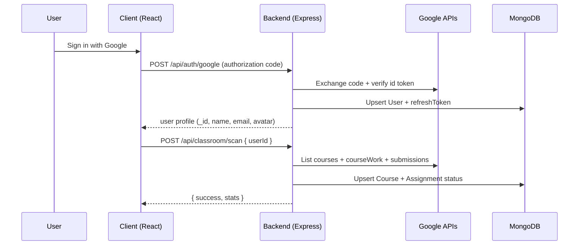
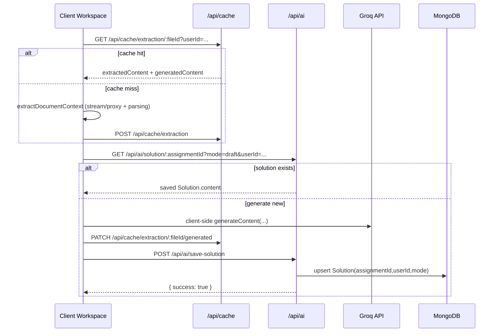
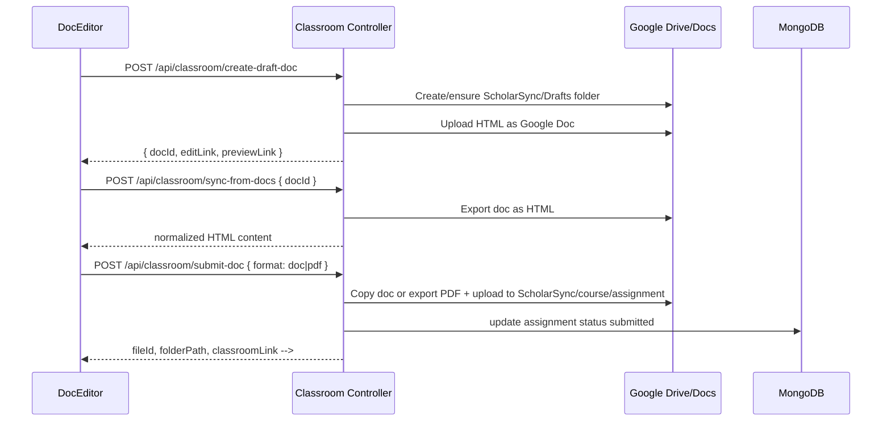

# ScholarSync

AI-assisted Google Classroom workflow app with a React client and Node/Express backend.

This README is based on the current codebase in this repository (client + server), not on template docs.

## What It Does

ScholarSync helps a student:
- Sign in with Google OAuth.
- Sync courses and assignments from Google Classroom.
- Open an assignment workspace and extract content from attached files.
- Generate AI outputs (draft solution, explain, quiz, flashcards).
- Chat with assignment content (streaming).
- Create/edit Google Docs drafts, sync edits back, and submit as Doc/PDF to Drive workflow folders.

## High-Level Architecture

- Frontend: React 19 + Vite (`client/`)
- Backend: Express 5 + Mongoose (`server/`)
- Database: MongoDB
- Integrations: Google OAuth, Google Classroom API, Google Drive/Docs APIs, Groq API

### Key Pattern Used

- User Groq API key is stored client-side (`localStorage`) and sent as `x-groq-api-key` header for backend endpoints that need it.
- AI generation happens in both places:
  - client-side generation service (`client/src/services/aiGenerationService.js`)
  - backend generation service (`server/services/aiService.js`)
- Caching is layered:
  - extraction/generated cache by `userId + fileId` (`ExtractionCache`)
  - persisted solutions by `assignmentId + userId + mode` (`Solution`)

## Repository Structure

- `client/`: Vite React app (UI, workspace, client-side AI services)
- `server/`: Express API, Google integrations, extraction/generation orchestration
- `project_metadata.json`: project summary metadata

## Frontend Overview (`client/src`)

- `App.jsx`
  - Route map + protected routes.
  - Main pages: landing, login, dashboard, profile, workspace.
- `pages/Workspace.jsx`
  - Core assignment workspace orchestration.
  - Document selection, extraction, generation, regenerate, tabs.
- `hooks/useClientSideAI.js`
  - Main client AI workflow hook:
    - extraction
    - generation
    - chat
    - cache load/save/clear
    - Mongo saved generation preload
- `features/workspace/DocEditor.jsx`
  - Google Docs draft lifecycle:
    - create draft doc
    - preview/sync
    - share (download/whatsapp/mail/copy)
    - submit doc/pdf
- `features/workspace/ChatWithAssignment.jsx`
  - Chat UI with streaming and chat history persistence.
- `services/groqService.js`
  - Direct Groq chat + streaming + usage tracking + pricing dashboard data.
- `components/dashboard/ApiUsageCharts.jsx`
  - API usage analytics by day/model and rate-limiter status.

## Backend Overview (`server`)

### Entry

- `server.js`
  - CORS with allowlist from `CLIENT_URL`.
  - JSON payload limit 50MB.
  - Mounts route groups:
    - `/api/auth`
    - `/api/classroom`
    - `/api/ai`
    - `/api/stream`
    - `/api/cache`

### Route Groups

- `routes/authRoutes.js`
  - Google auth endpoint.
- `routes/classroomRoutes.js`
  - classroom sync, extraction trigger, docs workflow, submission.
- `routes/aiRoutes.js`
  - generation/chat/history/solution persistence/question verification.
- `routes/streamRoutes.js`
  - memory-efficient Drive streaming proxy.
- `routes/cacheRoutes.js`
  - extraction/generated cache CRUD + stats.

### Core Controllers

- `controllers/authController.js`
  - Exchanges OAuth code, verifies ID token, upserts user + refresh token.
- `controllers/classroomController.js`
  - Assignment extraction endpoint, Google Docs create/open/sync/submit flows.
- `controllers/aiController.js`
  - AI generate/explain/chat endpoints + chat history + save solution + question verification.
- `controllers/streamController.js`
  - Streams Drive files; converts DOCX to PDF for client compatibility.
- `controllers/cacheController.js`
  - Reads/writes extraction cache and generated content per mode.

### Core Services

- `services/classroomService.js`
  - Pulls courses/coursework/submission states from Classroom; upserts `Course` and `Assignment`.
- `services/aiService.js`
  - Main backend generation/chat logic; includes multi-agent path for draft/explain.
- `services/agentService.js`
  - Validator/solver/reviewer pipeline for higher-quality generated solutions.
- `services/questionVerifier.js`
  - Low-token question quality checks (local-first, optional AI verification).
- `utils/extractor.js`
  - Material extraction from PDF/image/docx/text with vision-assisted page extraction and question structuring.

## Data Models

- `User`
  - Google identity + refresh token + preferences.
- `Course`
  - Classroom course mirror.
- `Assignment`
  - Coursework metadata + extraction payload + submission status.
- `Solution`
  - Saved output by `assignmentId + userId + mode`.
- `ExtractionCache`
  - Cached extracted content and generated mode content per `userId + fileId`.
- `Chat`
  - Assignment-scoped chat history per user.

## Verified API Endpoints

### Auth

- `POST /api/auth/google`

### Classroom

- `GET /api/classroom/courses/:userId`
- `GET /api/classroom/assignments/:userId`
- `POST /api/classroom/scan`
- `POST /api/classroom/assignments/:assignmentId/extract`
- `POST /api/classroom/submit`
- `POST /api/classroom/open-in-docs`
- `POST /api/classroom/sync-from-docs`
- `POST /api/classroom/create-draft-doc`
- `POST /api/classroom/submit-doc`

### AI

- `POST /api/ai/generate`
- `POST /api/ai/explain`
- `GET /api/ai/solution/:assignmentId`
- `GET /api/ai/solutions/:assignmentId` (alias)
- `POST /api/ai/chat`
- `POST /api/ai/chat-stream`
- `GET /api/ai/chat-history/:assignmentId`
- `POST /api/ai/chat-history`
- `DELETE /api/ai/chat-history/:assignmentId`
- `POST /api/ai/save-solution`
- `POST /api/ai/save-extracted`
- `POST /api/ai/verify-questions`
- `POST /api/ai/quick-verify-questions`

### Stream Proxy

- `GET /api/stream/download/:fileId`
- `GET /api/stream/metadata/:fileId`
- `GET /api/stream/check/:fileId`

### Cache

- `GET /api/cache/extraction/:fileId`
- `POST /api/cache/extraction`
- `PATCH /api/cache/extraction/:fileId/generated`
- `DELETE /api/cache/extraction/:fileId`
- `GET /api/cache/stats`

## Environment Variables

### Server (`server/.env`)

Required:
- `MONGO_URI`
- `GOOGLE_CLIENT_ID`
- `GOOGLE_CLIENT_SECRET`

Common:
- `PORT` (default `5000`)
- `CLIENT_URL` (comma-separated allowlist for CORS; defaults to `http://localhost:5173`)
- `GROQ_MODEL` (optional override)
- `GROQ_VISION_MODEL` (optional override)

### Client (`client/.env`)

Required:
- `VITE_SERVER_URL` (example: `http://localhost:5000`)
- `VITE_GOOGLE_CLIENT_ID`

Runtime requirement:
- user sets `groq_api_key` in Profile (stored in browser localStorage)

## Local Development

Open two terminals.

### 1) Backend

```bash
cd server
npm install
npm run dev
```

### 2) Frontend

```bash
cd client
npm install
npm run dev
```

Then open the Vite URL (usually `http://localhost:5173`).

## Build

Frontend production build:

```bash
cd client
npm run build
```

## Notes on Current Behavior

- Chat supports streaming and can persist assignment chat history.
- Docs workflow uses Google Docs conversion and sync endpoints, with HTML normalization for code/terminal/table blocks.
- Streaming proxy avoids loading large files fully in server memory; DOCX files are converted to PDF before returning to client.
- API usage analytics are tracked locally in browser storage via `groqService` usage tracking.

## Quick Troubleshooting

- "API key missing/invalid": set Groq key in Profile and retry.
- "No extracted content": run extraction from Workspace first.
- Google API errors (401/403): user refresh token may be stale or file permission is restricted.
- CORS blocked: ensure frontend origin is included in server `CLIENT_URL`.

<!-- ## Sequence Diagrams

### 1) Login + Classroom Sync


```mermaid
sequenceDiagram
    participant U as User
    participant C as Client (React)
    participant B as Backend (Express)
    participant G as Google APIs
    participant DB as MongoDB

    U->>C: Sign in with Google
    C->>B: POST /api/auth/google (authorization code)
    B->>G: Exchange code + verify id token
    B->>DB: Upsert User + refreshToken
    B-->>C: user profile (_id, name, email, avatar)

    C->>B: POST /api/classroom/scan { userId }
    B->>G: List courses + courseWork + submissions
    B->>DB: Upsert Course + Assignment status
    B-->>C: { success, stats }
```

### 2) Workspace Extraction + Generation + Save


```mermaid
sequenceDiagram
    participant C as Client Workspace
    participant Cache as /api/cache
    participant B as /api/ai
    participant Groq as Groq API
    participant DB as MongoDB

    C->>Cache: GET /api/cache/extraction/:fileId?userId=...
    alt cache hit
        Cache-->>C: extractedContent + generatedContent
    else cache miss
        C->>C: extractDocumentContext (stream/proxy + parsing)
        C->>Cache: POST /api/cache/extraction
    end

    C->>B: GET /api/ai/solution/:assignmentId?mode=draft&userId=...
    alt solution exists
        B-->>C: saved Solution.content
    else generate new
        C->>Groq: client-side generateContent(...)
        C->>Cache: PATCH /api/cache/extraction/:fileId/generated
        C->>B: POST /api/ai/save-solution
        B->>DB: upsert Solution(assignmentId,userId,mode)
        B-->>C: { success: true }
    end
```

### 3) Google Docs Draft + Sync + Submit


```mermaid
sequenceDiagram
    participant C as DocEditor
    participant B as Classroom Controller
    participant G as Google Drive/Docs
    participant DB as MongoDB

    C->>B: POST /api/classroom/create-draft-doc
    B->>G: Create/ensure ScholarSync/Drafts folder
    B->>G: Upload HTML as Google Doc
    B-->>C: { docId, editLink, previewLink }

    C->>B: POST /api/classroom/sync-from-docs { docId }
    B->>G: Export doc as HTML
    B-->>C: normalized HTML content

    C->>B: POST /api/classroom/submit-doc { format: doc|pdf }
    B->>G: Copy doc or export PDF + upload to ScholarSync/course/assignment
    B->>DB: update assignment status submitted
    B-->>C: fileId, folderPath, classroomLink -->
```

## API Examples

All examples use `BASE_URL=http://localhost:5000/api` and JSON request bodies.

### 1) Google Auth

Request:

```bash
curl -X POST "$BASE_URL/auth/google" \
  -H "Content-Type: application/json" \
  -d '{"code":"<google_oauth_code>"}'
```

Typical response:

```json
{
  "success": true,
  "user": {
    "_id": "65f...",
    "name": "Student Name",
    "email": "student@example.com",
    "avatar": "https://..."
  }
}
```

### 2) Scan Classroom

Request:

```bash
curl -X POST "$BASE_URL/classroom/scan" \
  -H "Content-Type: application/json" \
  -d '{"userId":"65f..."}'
```

Typical response:

```json
{
  "success": true,
  "stats": {
    "submitted": 3,
    "missing": 1,
    "assigned": 8,
    "total": 12
  }
}
```

### 3) Generate Content (Backend route)

Request:

```bash
curl -X POST "$BASE_URL/ai/generate" \
  -H "Content-Type: application/json" \
  -H "x-groq-api-key: <your_groq_key>" \
  -d '{
    "assignmentId":"65a...",
    "userId":"65f...",
    "mode":"quiz",
    "questionCount":5,
    "difficulty":"medium",
    "questionType":"mixed"
  }'
```

Typical response shape:

```json
{
  "_id": "66b...",
  "assignmentId": "65a...",
  "userId": "65f...",
  "mode": "quiz",
  "content": {
    "questions": [
      {
        "id": 1,
        "type": "mcq",
        "question": "..."
      }
    ]
  }
}
```

### 4) Save Client-Generated Solution

Request:

```bash
curl -X POST "$BASE_URL/ai/save-solution" \
  -H "Content-Type: application/json" \
  -d '{
    "assignmentId":"65a...",
    "userId":"65f...",
    "mode":"draft",
    "content":"<h2>Question 1</h2><p>...</p>",
    "source":"client-side"
  }'
```

Typical response:

```json
{
  "success": true,
  "solutionId": "66c...",
  "mode": "draft"
}
```

### 5) Load Saved Solution by Mode

Request:

```bash
curl "$BASE_URL/ai/solution/65a...?mode=draft&userId=65f..."
```

Typical response (or `null` if not found):

```json
{
  "_id": "66c...",
  "assignmentId": "65a...",
  "userId": "65f...",
  "mode": "draft",
  "content": "<h2>Question 1</h2><p>...</p>",
  "createdAt": "2026-03-30T10:00:00.000Z"
}
```

### 6) Extraction Cache APIs

Get cache:

```bash
curl "$BASE_URL/cache/extraction/<fileId>?userId=65f..."
```

Save extraction:

```bash
curl -X POST "$BASE_URL/cache/extraction" \
  -H "Content-Type: application/json" \
  -d '{
    "userId":"65f...",
    "fileId":"1Abc...",
    "fileName":"assignment.pdf",
    "assignmentId":"65a...",
    "extractedContent": {
      "content":"...",
      "pageCount": 6,
      "hasImages": true,
      "tokenEstimate": 5400
    }
  }'
```

### 7) Create Draft Google Doc

Request:

```bash
curl -X POST "$BASE_URL/classroom/create-draft-doc" \
  -H "Content-Type: application/json" \
  -d '{
    "assignmentId":"65a...",
    "userId":"65f...",
    "title":"Assignment_Solution",
    "courseName":"Physics",
    "content":"<h2>Question 1</h2><p>...</p>"
  }'
```

Typical response:

```json
{
  "success": true,
  "docId": "1DocId...",
  "editLink": "https://docs.google.com/document/d/1DocId.../edit",
  "previewLink": "https://docs.google.com/document/d/1DocId.../preview",
  "folderPath": "ScholarSync/Drafts"
}
```

### 8) Submit Doc/PDF to Drive Workflow

Request:

```bash
curl -X POST "$BASE_URL/classroom/submit-doc" \
  -H "Content-Type: application/json" \
  -d '{
    "docId":"1DocId...",
    "assignmentId":"65a...",
    "userId":"65f...",
    "format":"pdf",
    "courseName":"Physics",
    "assignmentTitle":"Wave Assignment"
  }'
```

Typical response:

```json
{
  "success": true,
  "fileId": "1DriveFile...",
  "fileName": "Wave Assignment_Solution_2026-03-30.pdf",
  "format": "pdf",
  "folderPath": "ScholarSync/Physics/Wave Assignment",
  "classroomLink": "https://classroom.google.com/..."
}
```
