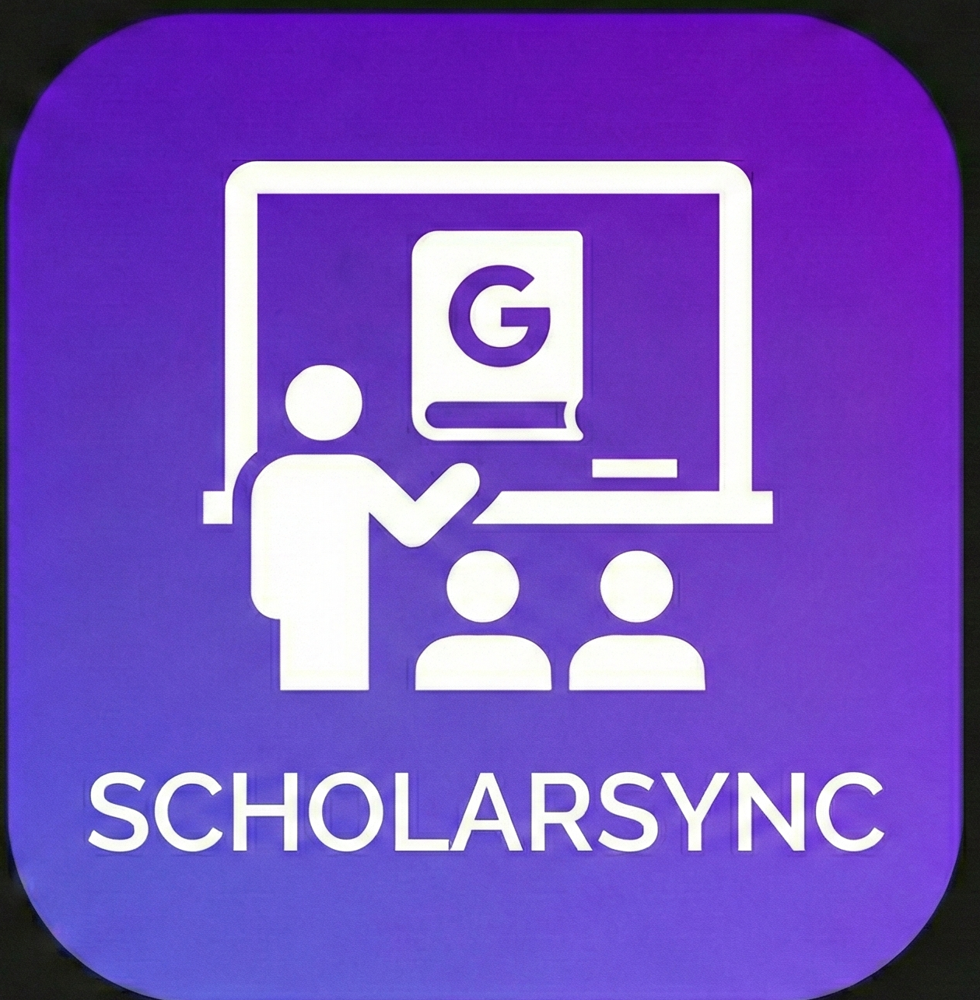
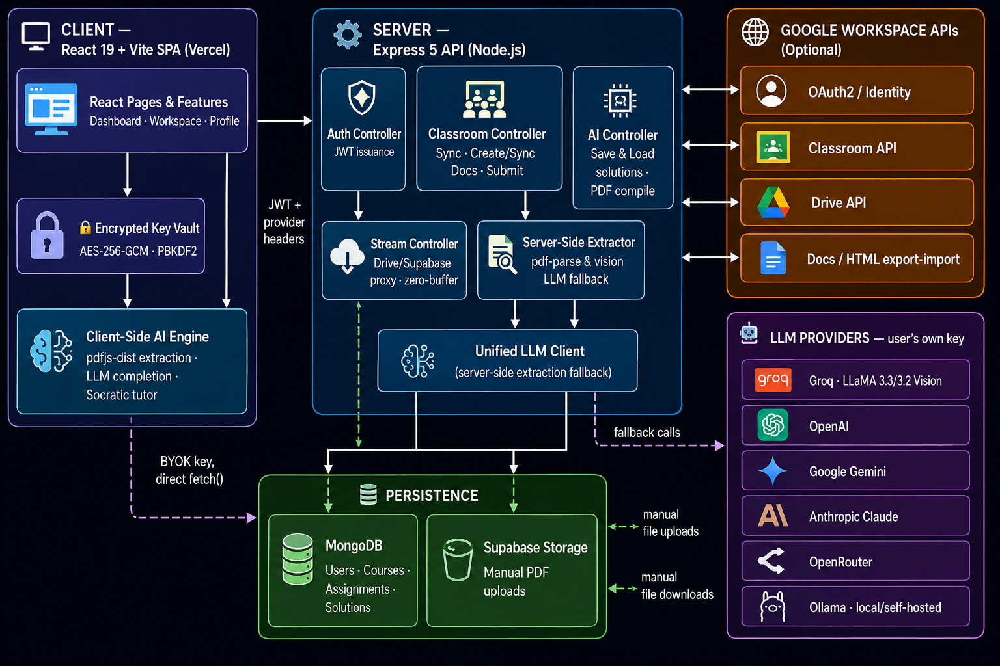
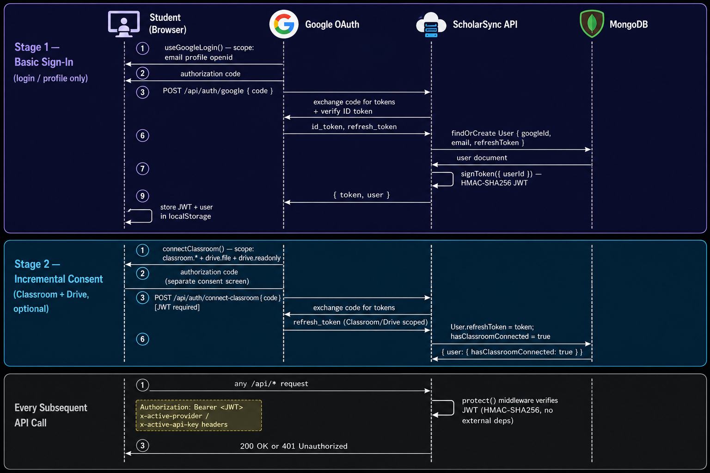
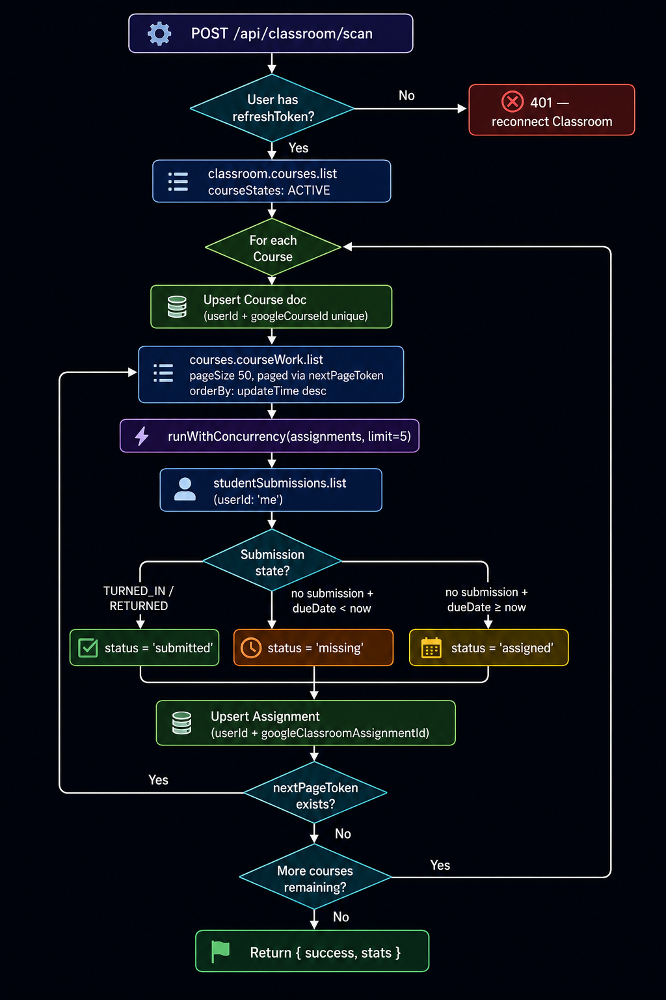
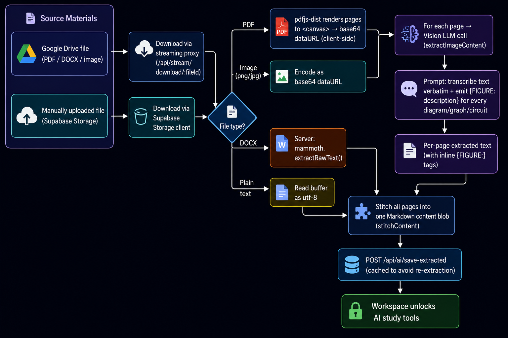
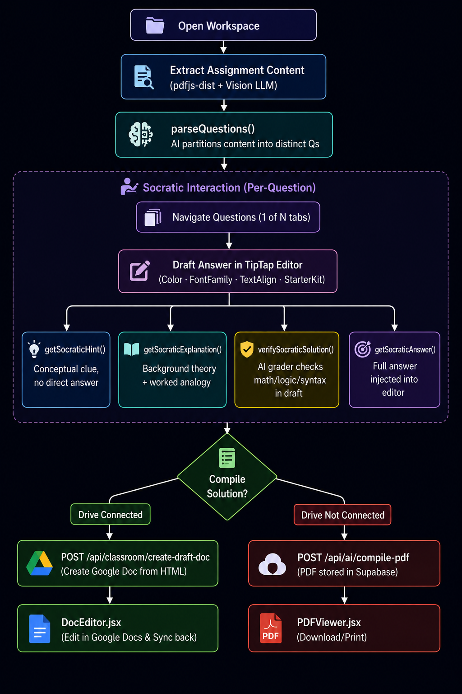
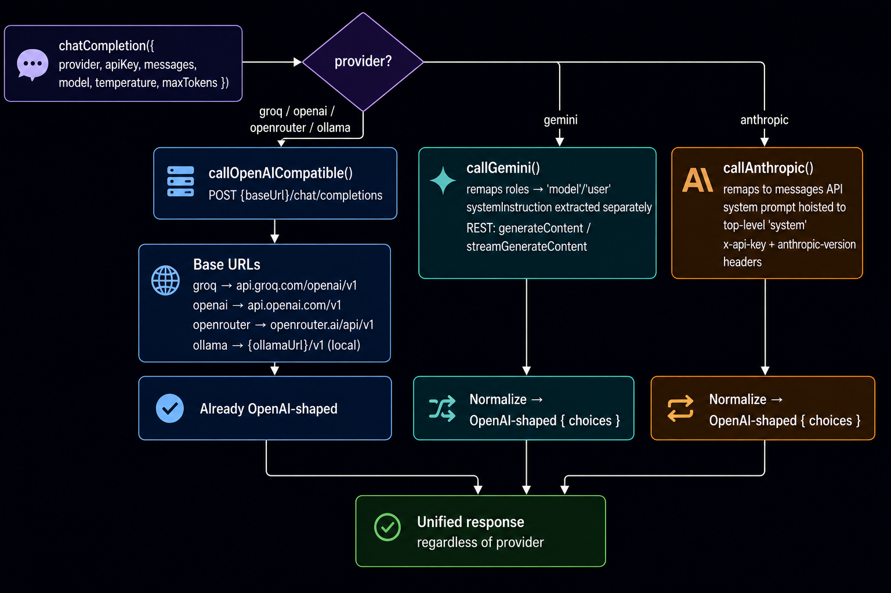
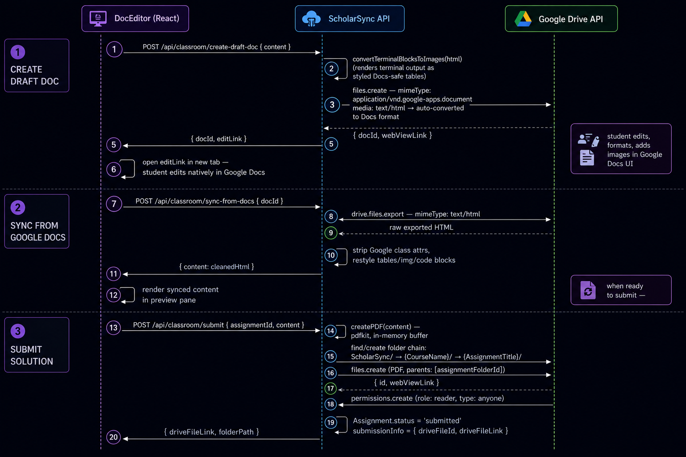
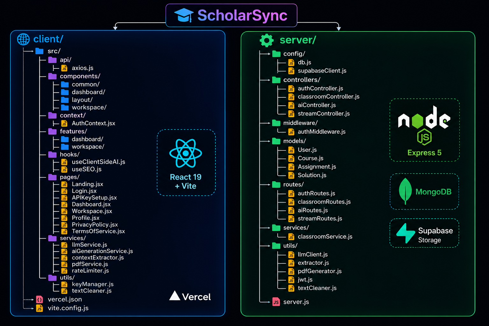
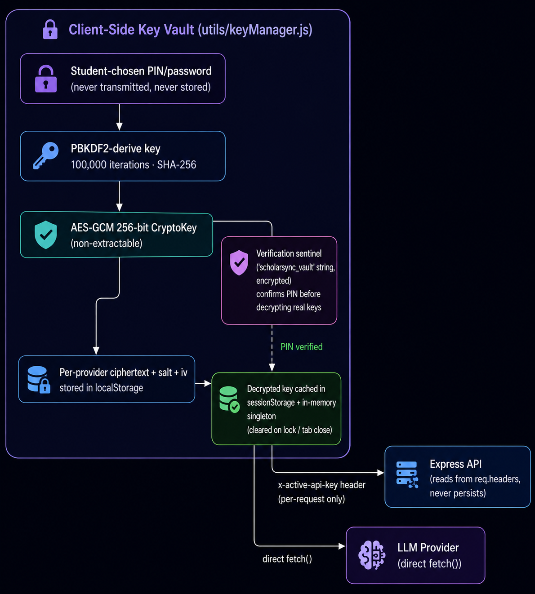

<div align="center">



# ScholarSync

### The AI-powered Assignment Learning App that syncs your coursework, supports custom uploads, and simplifies submissions.

**Google Classroom × Google Drive × Custom Uploads × Bring‑Your‑Own‑Key, in one calm workspace.**

[](https://react.dev)
[](https://vitejs.dev)
[](https://nodejs.org)
[](https://www.mongodb.com)
[](https://supabase.com)
[](https://tailwindcss.com)
[](#-license)

[](#)
[](#)
[](#)
[](#-multi-provider-llm-layer)
[](#-security-architecture)

<br/>

[Overview](#-overview) •
[Architecture](#-system-architecture) •
[Features](#-feature-deep-dive) •
[Tech Stack](#-tech-stack) •
[Getting Started](#-getting-started) •
[API Reference](#-api-reference) •
[Data Models](#-data-models) •
[Security](#-security-architecture) •
[Roadmap](#-roadmap)

</div>

---

## 📖 Overview

**ScholarSync** is an AI-powered assignment learning app that syncs coursework from **Google Classroom**, supports direct **custom uploads** of local PDF assignments, and integrates with **Google Drive** for a seamless, automated submission experience. **Connecting to Google Classroom is completely optional:** you can disconnect classroom access at any time, and use manual uploads to study and compile PDF assignments completely independently.

It was built to answer one question: *what if your assignments could teach you?*

Once connected, ScholarSync automatically syncs courses and coursework, extracts question text and diagrams out of PDFs/DOCX/images using **vision‑capable LLMs**, and then lets the student **explain, quiz, flash‑card, chat with, or draft and verify a solution** for any assignment — before writing the result straight back into a structured `ScholarSync/Course/Assignment` folder on the student's own Google Drive.

What makes the architecture distinctive is that **almost none of this requires ScholarSync's own servers to call an LLM on the user's behalf**. The product is built around a **Bring‑Your‑Own‑Key (BYOK)** model: the student supplies an API key (Groq, OpenAI, Gemini, Anthropic, OpenRouter, or a local Ollama endpoint), the key is **AES‑256‑GCM encrypted in the browser**, and most AI calls — PDF parsing, vision extraction, content generation, chat, and Socratic tutoring — happen **client‑side, directly from the browser to the model provider.** The Node/Express backend exists for OAuth, Classroom/Drive orchestration, persistence, and an extraction fallback, not as a mandatory AI gateway.

<table>
<tr>
<td width="50%" valign="top">

### 🎯 What it does for a student
- Pulls courses and coursework from Google Classroom, and supports custom PDF assignment uploads
- Reads PDFs/DOCX/images (text **and** diagrams) using vision AI in the browser
- Explains concepts, builds interactive quizzes, and designs flashcards
- Runs a Socratic tutor that guides the student, checks drafts, and provides hints
- Edits compiled solutions as a real Google Doc, then submits straight to Drive in an organized folder structure

</td>
<td width="50%" valign="top">

### 🏗️ What makes it interesting as a system
- **Direct Client-Side Execution** — browser executes the extraction and AI completions directly with provider endpoints
- **Interactive Socratic Grader** — evaluates student answers, offering hints and explanations without spoon‑feeding answers
- **6‑provider unified LLM client** with a single internal interface for chat, vision, and streaming
- **Client‑side encrypted key vault** (PBKDF2 + AES‑GCM) — provider keys never sit in plaintext, even locally
- **Memory‑safe streaming proxy** for Google Drive downloads to avoid OOM crashes on constrained hosts
- **Incremental OAuth scopes** — Classroom/Drive access requested only when the student opts in

</td>
</tr>
</table>


<br/>

## 📑 Table of Contents

1. [System Architecture](#-system-architecture)
2. [Client-Side AI Execution & Server Fallback](#-client-side-ai-execution--server-fallback)
3. [Authentication & OAuth Flow](#-authentication--oauth-flow)
4. [Classroom Sync Workflow](#-classroom-sync-workflow)
5. [Document Extraction Pipeline (Vision AI)](#-document-extraction-pipeline-vision-ai)
6. [Socratic Study & Solution Formatting](#-socratic-study--solution-formatting)
7. [Multi-Provider LLM Layer](#-multi-provider-llm-layer)
8. [Submission & Google Docs Sync Workflow](#-submission--google-docs-sync-workflow)
9. [Feature Deep Dive](#-feature-deep-dive)
10. [Tech Stack](#-tech-stack)
11. [Repository Structure](#-repository-structure)
12. [Data Models (ER Diagram)](#-data-models)
13. [API Reference](#-api-reference)
14. [Security Architecture](#-security-architecture)
15. [Getting Started](#-getting-started)
16. [Environment Variables](#-environment-variables)
17. [Deployment](#-deployment)


---

## 🏛 System Architecture

ScholarSync is composed of two independently deployable applications that share a contract over a REST API: a **React SPA** (Vercel) and a **Node/Express API** (Render‑style host), backed by **MongoDB** for application data and **Supabase Storage** for manually‑uploaded files. Google's **Classroom, Drive, and OAuth2 APIs** are the system of record for coursework, and any of **six LLM providers** can power the AI layer, selected per‑user.

<p align="center">
  
</p>


**Reading the diagram:** the client talks to Google's APIs *only through the server* (because OAuth refresh tokens live server‑side), but talks to LLM providers **directly from the browser** whenever the BYOK key is available — the server's own LLM client (`llmClient.js`) exists mainly as a fallback implementation for server-triggered document extraction.

---

## 🔀 Client-Side AI Execution & Server Fallback

ScholarSync prioritizes a **Bring‑Your‑Own‑Key (BYOK)** model. The student supplies their own API key (Groq, OpenAI, Gemini, Anthropic, OpenRouter, or a local Ollama endpoint), which is **AES‑256‑GCM encrypted in the browser**. 

To maximize privacy and avoid handling raw keys on the server unnecessarily, the application runs its primary AI pipelines — document extraction, vision parsing, study guide compilation, quiz generation, and Socratic tutoring — **directly in the client browser**. 

The server does not perform AI generation, and instead serves as a facilitator for authentication, Google Docs creation/sync, zero-buffer file streaming, and file persistence. The server also contains a fallback extraction pipeline if triggered externally.

| | **Client-Side Pipeline** (`contextExtractor.js`, `llmService.js`, `aiGenerationService.js`) | **Server-Side Pipeline** (`extractor.js`, `llmClient.js`) |
|---|---|---|
| **Where it runs** | Directly in the student's browser | On the Express API process |
| **Who pays for inference** | The student's own provider account, billed directly | Student's key, passed via headers |
| **PDF parsing** | `pdfjs-dist` renders pages to canvas client-side | `pdf-parse` page-to-image rasterization |
| **Network hop for AI calls** | Browser → LLM provider (one hop) | Browser → Server → LLM provider (two hops) |
| **Primary use case** | Default extraction, study guide generation, quiz/flashcard creation, and Socratic tutor interactions | Fallback for server-side PDF/image text extraction |
| **Persistence** | Saves results to MongoDB via `/ai/save-solution` & `/ai/save-extracted` | Updates the `Assignment` document with extracted text |

**The rationale:** because ScholarSync is BYOK, routing every token through the server would mean the server *handles* the user's raw API key on every request even when it doesn't strictly need to. The client-side pipeline keeps the key (and the inference cost) entirely between the student and their chosen provider. Both client and server converge on the same MongoDB `Solution` and `Assignment` documents, keeping the interface unified and responsive.

---

## 🔐 Authentication & OAuth Flow

Google OAuth is split into **two independent consent flows** with different scopes, requested at different times — a deliberate "principle of least privilege" design rather than asking for Classroom/Drive access at sign-up.

<p align="center">
  
</p>


**Implementation notes:**
- The JWT implementation in `utils/jwt.js` is a **hand-rolled HS256 signer/verifier** built on Node's native `crypto.createHmac` — there is no external JWT library dependency.
- The `protect` middleware (`middleware/authMiddleware.js`) accepts the token from the `Authorization: Bearer` header, a `?token=` query param (useful for iframe/redirect navigations), or a cookie — in that priority order.
- `disconnectClassroom` doesn't just clear a flag: it **revokes the Google refresh token**, wipes `user.classrooms`, and cascades a delete of every non-manual `Assignment` + its `Solution`s, plus all `Course` documents for that user — a genuine data-teardown, not a soft toggle.

---

## 🔄 Classroom Sync Workflow

Triggering a sync (`POST /api/classroom/scan`) pulls every active course, then every piece of coursework inside it, then checks the **student's own submission status** for each — all while respecting Google's pagination and avoiding API hammering via a small concurrency pool.

<p align="center">
  
</p>


**Why `runWithConcurrency`?** Fetching submission status is one Classroom API call *per piece of coursework*. A class with 60 assignments would otherwise mean 60 sequential round-trips. `services/classroomService.js` implements a tiny worker-pool (`limit = 5`) so up to five submission lookups run in parallel per course, trading a small amount of complexity for a meaningfully faster scan without tripping Google's per-user rate limits.

**Status derivation logic** (the actual rule encoded in `scanClassroomService`):
1. If a submission exists and its state is `TURNED_IN` or `RETURNED` → **`submitted`**.
2. Else, if the assignment has a due date that has already passed → **`missing`**.
3. Otherwise → **`assigned`** (default state for anything not yet due or not yet attempted).

Once assignments are upserted, the **Dashboard** (`pages/Dashboard.jsx` + `features/dashboard/AssignmentList.jsx`) reads them back through `GET /api/classroom/assignments/:userId?mode=...`, where `mode` can be `all`, `assigned`, `submitted`, `missing`, or `byCourse` — each mapping to a different MongoDB query built in `getAssignments`.

---

## 👁 Document Extraction Pipeline (Vision AI)

This is where ScholarSync earns the "AI" in its pitch. Rather than relying on naive PDF text extraction (which loses diagrams, circuits, graphs, and hand-drawn figures entirely), assignment PDFs are **rasterized page-by-page into images** and passed to a **vision-capable LLM**, which transcribes *both* the text and a structured description of every figure it sees.

<p align="center">
  
</p>


**Two implementations of the same idea exist side by side:**

| Stage | Server-side (`utils/extractor.js`) | Client-side (`services/contextExtractor.js` + `pdfService.js`) |
|---|---|---|
| PDF → image | `pdf-parse`'s `getScreenshot()` | `pdfjs-dist` rendering to an in-browser `<canvas>` |
| Vision call | `chatCompletion()` with `visionModel` (default `llama-3.2-90b-vision-preview`) | `extractImageContent()` in `llmService.js`, same provider abstraction |
| Output shape | Structured Q&A JSON (`{questions, extractedContent, importantInfo}`) via a second text-LLM pass | Markdown-stitched content (`stitchContent()`), consumed directly by generation prompts |
| Trigger | `POST /api/classroom/assignments/:id/extract` (used by legacy/server flow) | `useClientSideAI().extractContent()` (default flow from the Workspace UI) |

**A deliberate extraction safeguard:** the system prompt used for the Q&A structuring pass explicitly instructs the model to **skip any "Solutions", "Answer Key", or "Worked Example" sections** and leave the `answer` field `null` — the extraction stage is scoped to *capturing the question*, never to harvesting an answer key that might be embedded later in the same document. Failed files (encrypted PDFs, corrupted documents, permission-denied Drive files) are collected into a `_warnings` array rather than aborting the whole batch.

---

---

## 🎓 Socratic Study & Solution Formatting

Rather than generating full answer sheets in a single-pass without student involvement, ScholarSync supports an interactive, structured study flow via the **AI Socratic Tutor** mode. 

<p align="center">
  
</p>


### Key Stages of Socratic Tutoring:
1. **Question Partitioning**: The client uses `parseQuestions()` to analyze the extracted document and structure it as a sequential array of questions, mapping them to tabs in the workspace interface.
2. **Socratic Prompting**: 
   - **Hint** (`getSocraticHint`): Nudges the student toward the right formula or concept without revealing calculations.
   - **Explanation** (`getSocraticExplanation`): Provides background theories and templates a worked analogy with different parameters.
   - **Verify Solution** (`verifySocraticSolution`): Acts as a grader, analyzing math, logic, or syntax in the editor to report mistakes and outline correction steps.
   - **Give Answer** (`getSocraticAnswer`): Acts as an override option that generates the final mathematical or coding solution, placing it directly into the student's editor window.
3. **Draft Compilation**: When the student completes their draft answers, the "Compile Doc" (or "Compile PDF") flow bundles all active questions and drafts into a unified document matching their layout preferences (color theme, margins, text sizes, line spacing).

## 🌐 Multi-Provider LLM Layer

Both the client (`services/llmService.js`) and server (`utils/llmClient.js`) implement the **same provider-agnostic interface** — `chatCompletion()` and `chatCompletionStream()` — that normalizes six very different upstream APIs into one OpenAI-style `{ choices: [{ message: { content } }] }` response shape.

<p align="center">
  
</p>


| Provider | Endpoint shape | Vision support | Streaming | Notes |
|---|---|---|---|---|
| **Groq** | OpenAI-compatible | ✅ (`llama-3.2-90b-vision-preview`) | ✅ SSE | Default provider; powers the marketing claim "Powered by LLaMA 3.3 70B" |
| **OpenAI** | OpenAI-compatible | ✅ | ✅ SSE | Drop-in via base URL swap |
| **OpenRouter** | OpenAI-compatible | Model-dependent | ✅ SSE | Aggregator — exposes many underlying models through one key |
| **Ollama** | OpenAI-compatible (local) | Model-dependent | ✅ SSE | The *only* provider that needs no API key — `ollamaUrl` defaults to `http://localhost:11434` |
| **Google Gemini** | Native REST (`generateContent`) | ✅ (`inlineData` base64) | ✅ (custom SSE-like parser over `streamGenerateContent`) | System messages remapped to `systemInstruction` |
| **Anthropic Claude** | Native Messages API | ✅ (`image` content blocks) | ✅ (`content_block_delta` parsing) | JSON-mode requests get an explicit "return valid JSON" instruction appended to `system`, since Claude has no `response_format` parameter |

**Header-driven provider selection:** every authenticated API request from the client carries `x-active-provider`, `x-active-api-key`, `x-active-text-model`, `x-active-vision-model`, and `x-ollama-url` headers, attached by an Axios interceptor in `api/axios.js`. The server never stores these values — `getLlmConfig(req)` reads them fresh on every request and discards them once the response is sent. This is the literal mechanism by which "bring your own key" is enforced end-to-end: the key only ever exists in the browser's encrypted vault and in the memory of a single in-flight request.

---

## 📤 Submission & Google Docs Sync Workflow

A drafted solution isn't locked into ScholarSync's own editor. The student can push it into a **real, editable Google Doc**, make changes there (tables, images, formatting Google Docs handles natively), pull those edits back, and finally submit a clean PDF straight to a structured Drive folder.

<p align="center">
  
</p>


**Folder convention enforced server-side:** every submission lands under `ScholarSync/<CourseName>/<AssignmentTitle>/Solution_<date>.pdf` in the student's own Drive — the controller searches for each folder level by name before creating it, so re-submitting the same assignment reuses the existing folder rather than duplicating it.

**Terminal-output rendering:** because the AI is explicitly instructed (see [system prompts](#-multi-agent-solution-generation)) to show realistic "program run" console output after every code block, `classroomController.js` includes a small HTML-to-Docs transform (`convertTerminalBlocksToImages` → `createTerminalOutputDocsHtml`) that turns `<div class="terminal-output">` blocks into Docs-safe styled tables, since Google Docs' HTML importer doesn't reliably preserve `<pre>`/dark-background styling otherwise.

---

## ✨ Feature Deep Dive

<table>
<tr><th width="26%">Feature</th><th>How it actually works</th></tr>

<tr>
<td><strong>📚 Classroom Dashboard</strong></td>
<td>

`Dashboard.jsx` renders live stats (`StatCard`) — total / submitted / missing / assigned — sourced from `GET /api/classroom/stats/:userId`, plus a paginated, filterable assignment grid (`AssignmentList.jsx`, 9 per page) with a course filter sidebar (`CourseFilter.jsx`). Stats are computed with real MongoDB `countDocuments` queries rather than cached client-side.

</td>
</tr>

<tr>
<td><strong>🧠 AI Explain Mode</strong></td>
<td>

Runs the explain mode client-side: Overview → Core Concepts (with definitions + real-world examples) → Important Formulas → Common Mistakes → Study Tips, rendered as clean semantic HTML with `<h2>`/`<h3>` structure, formula `<code>` tags, and comparison tables.

</td>
</tr>

<tr>
<td><strong>📝 Socratic Study Panel & Editor</strong></td>
<td>

The core learning workspace (`SocraticStudyPanel.jsx`, ~970 lines): instead of handing over answers, it offers **hints**, **analogy-based explanations**, and **verification of student attempts** via separate conceptual AI calls (`getSocraticHint`, `getSocraticExplanation`, `verifySocraticSolution`) with a direct-answer escape hatch (`getSocraticAnswer`). Includes a rich TipTap editor for drafting answers to each question.

</td>
</tr>

<tr>
<td><strong>❓ Smart Quiz Generator</strong></td>
<td>

`QuizOptionsModal.jsx` lets the student pick question count, difficulty, and type before generation. The prompt dynamically tailors instructions (e.g. hard ⇒ "multi-step problems requiring deep understanding"), and the LLM returns strict JSON consumed by `Quiz.jsx` for an interactive, scored quiz-taking UI.

</td>
</tr>

<tr>
<td><strong>🗂️ AI Flashcard Generator</strong></td>
<td>

Client-side structured-JSON generation pass producing 10–15 front/back/category cards, rendered as an interactive flip-card study UI in `Flashcards.jsx`.

</td>
</tr>

<tr>
<td><strong>📄 In-Browser PDF Viewer</strong></td>
<td>

`PDFViewer.jsx` renders assignment PDFs using `pdfjs-dist` directly in the workspace split-view, allowing the student to read original documents side-by-side with editor and study tools — without server round-trips once retrieved.

</td>
</tr>

<tr>
<td><strong>✍️ Manual Assignment Creation</strong></td>
<td>

`createManualAssignment` + `uploadManualFiles` let a student create a local assignment, upload PDFs, and store them in **Supabase Storage** with a compatible material shape so the extraction pipeline works transparently on manual and synced assignments alike.

</td>
</tr>

<tr>
<td><strong>📊 API Usage Dashboard</strong></td>
<td>

`ApiUsageDashboard.jsx` + `ApiUsageCharts.jsx` surface token counts, estimated cost (against a pricing table per provider/model), and live rate-limiter state — directly showing BYOK key usage metrics without server involvement.

</td>
</tr>

<tr>
<td><strong>🔑 Encrypted API Key Vault</strong></td>
<td>

A PIN-protected vault UI (`VaultUnlockModal.jsx`, `APIKeySetup.jsx`) using the Web Crypto API (AES-256-GCM + PBKDF2 key derivation) to encrypt and manage API keys locally in the browser's `localStorage`.

</td>
</tr>

</table>

---

## 🛠 Tech Stack

<table>
<tr><th width="20%">Layer</th><th>Technology</th><th>Purpose in this codebase</th></tr>
<tr><td rowspan="9"><strong>Frontend</strong></td><td>React 19</td><td>Component model for the whole SPA</td></tr>
<tr><td>Vite 7</td><td>Dev server + build tooling</td></tr>
<tr><td>React Router 7</td><td>Client-side routing (<code>/dashboard</code>, <code>/workspace/:assignmentId</code>, etc.)</td></tr>
<tr><td>Tailwind CSS v4</td><td>Utility-first styling via <code>@tailwindcss/vite</code> plugin</td></tr>
<tr><td>Framer Motion</td><td>Page/element transitions and micro-interactions</td></tr>
<tr><td>TipTap 3 (+ StarterKit)</td><td>Rich-text editor powering the Socratic study panel and solution editor</td></tr>
<tr><td>pdfjs-dist</td><td>Client-side PDF rendering &amp; page rasterization</td></tr>
<tr><td>lucide-react</td><td>Icon set used throughout the UI</td></tr>
<tr><td>react-hot-toast</td><td>Toast notifications for async feedback</td></tr>

<tr><td rowspan="6"><strong>Backend</strong></td><td>Node.js + Express 5</td><td>REST API server (ESM modules throughout)</td></tr>
<tr><td>Mongoose 9 / MongoDB</td><td>Primary application datastore</td></tr>
<tr><td>Supabase JS SDK</td><td>Object storage for manually-uploaded assignment files</td></tr>
<tr><td>googleapis + google-auth-library</td><td>Classroom, Drive, and OAuth2 integration</td></tr>
<tr><td>pdf-parse / pdfkit / mammoth / docx2pdf-converter</td><td>Server-side document parsing &amp; PDF generation</td></tr>
<tr><td>html-to-text</td><td>HTML→plaintext fallback for PDF export</td></tr>

<tr><td rowspan="2"><strong>AI / LLM</strong></td><td>Groq, OpenAI, Gemini, Anthropic, OpenRouter, Ollama</td><td>Six interchangeable inference providers behind one unified interface</td></tr>
<tr><td>Vision-language models</td><td>Diagram/figure transcription from rasterized PDF pages</td></tr>

<tr><td rowspan="3"><strong>Security</strong></td><td>Web Crypto API (AES-256-GCM, PBKDF2)</td><td>Client-side encrypted key vault</td></tr>
<tr><td>Hand-rolled JWT (HMAC-SHA256)</td><td>Stateless session auth, no external JWT dependency</td></tr>
<tr><td>OAuth 2.0 (incremental scopes)</td><td>Google identity + Classroom/Drive consent, requested separately</td></tr>

<tr><td rowspan="2"><strong>Hosting</strong></td><td>Vercel</td><td>Client SPA (see <code>vercel.json</code> rewrites/headers)</td></tr>
<tr><td>Render-style Node host</td><td>API server (health-check endpoint + cron-job.org ping support baked into <code>server.js</code>)</td></tr>
</table>

---

## 📁 Repository Structure

<p align="center">
  
</p>


## 🗄 Data Models

Four Mongoose collections capture the entire application state. Every collection that belongs to a user carries a `userId` reference, and three of them enforce **compound unique indexes** to make sync operations naturally idempotent (`findOneAndUpdate` + `upsert: true` instead of manual existence checks).

<p align="center">
  
</p>


**Notable schema decisions:**
- **`Assignment.materials`** is `[Mixed]` — it stores Google Drive's native material shape for synced assignments, *and* a Drive-API-compatible shape (`{ isManualFile: true, driveFile: {...} }`) for manually uploaded files, so the extraction pipeline can treat both uniformly without branching logic at the model layer.
- **`Solution.content`** is `Mixed` by design: `explain` stores an HTML string, while `quiz`/`flashcards` store a JSON object — one schema, two different payload shapes, validated at the application layer instead of the database layer.
- **Compound unique indexes** — `{userId, googleClassroomAssignmentId}` on `Assignment`, `{userId, googleCourseId}` on `Course`, and `{assignmentId, userId, mode}` on `Solution` — are what make every sync/generate operation safely re-runnable via `upsert: true` without ever producing duplicate rows.

---

## 📡 API Reference

All routes are mounted under `/api`. Every route except `/auth/google` requires `Authorization: Bearer <JWT>` (enforced by the `protect` middleware). AI routes additionally expect the BYOK headers described in [Multi-Provider LLM Layer](#-multi-provider-llm-layer).

<details>
<summary><b>🔑 Auth Routes — <code>/api/auth</code></b></summary>

| Method | Endpoint | Description |
|---|---|---|
| `POST` | `/google` | Exchange a Google auth code for app JWT + user profile (basic scopes only) |
| `POST` | `/connect-classroom` | Exchange a second auth code for Classroom/Drive-scoped refresh token |
| `POST` | `/disconnect-classroom` | Revoke Google token, wipe courses/assignments/solutions, reset connection flag |

</details>

<details>
<summary><b>🏫 Classroom Routes — <code>/api/classroom</code></b></summary>

| Method | Endpoint | Description |
|---|---|---|
| `GET` | `/courses/:userId` | List all synced courses for a user |
| `GET` | `/assignments/:userId?mode=&courseId=` | List assignments, filterable by `all`\|`assigned`\|`submitted`\|`missing`\|`byCourse` |
| `GET` | `/stats/:userId` | Live counts: total / submitted / missing / assigned |
| `POST` | `/scan` | Trigger a full Classroom + Drive sync (see [Classroom Sync Workflow](#-classroom-sync-workflow)) |
| `POST` | `/assignments/:assignmentId/extract` | Run server-side vision extraction fallback on materials |
| `POST` | `/submit` | Generate PDF, upload to Drive folder chain, mark assignment submitted |
| `POST` | `/open-in-docs` | Create an editable Google Doc from HTML content |
| `POST` | `/sync-from-docs` | Pull edited content back from a Google Doc as cleaned HTML |
| `POST` | `/create-draft-doc` | Create a draft Google Doc (used by `DocEditor.jsx`) |
| `POST` | `/submit-doc` | Submit directly from a synced Google Doc |
| `POST` | `/assignments/manual` | Create a manually-defined assignment (no Classroom link) |
| `POST` | `/assignments/:assignmentId/upload` | Attach base64-encoded files to a manual assignment (stored in Supabase) |

</details>

<details>
<summary><b>🤖 AI Routes — <code>/api/ai</code></b></summary>

| Method | Endpoint | Description |
|---|---|---|
| `GET` | `/solution/:assignmentId?mode=` | Fetch the latest persisted solution for a mode |
| `GET` | `/solutions/:assignmentId` | Alias of the above (frontend compatibility) |
| `POST` | `/save-solution` | Save a solution generated client-side (BYOK path) |
| `POST` | `/save-extracted` | Save content extracted client-side to avoid re-extraction |
| `POST` | `/compile-pdf` | Convert arbitrary HTML into a downloadable PDF |

</details>

<details>
<summary><b>📦 Stream Routes — <code>/api/stream</code></b></summary>

| Method | Endpoint | Description |
|---|---|---|
| `GET` | `/download/:fileId` | Zero-buffer proxy stream of a Drive (or Supabase, for manual files) file; auto-converts DOCX → PDF |
| `GET` | `/metadata/:fileId` | Fetch file metadata (name, mimeType, size, thumbnail) without downloading |
| `GET` | `/check/:fileId` | Pre-flight accessibility check (permission/external-org/expired-token detection) |

</details>

> 💡 **Why a streaming proxy at all?** `streamController.js`'s docstring states the rationale directly: piping the Drive response stream straight to the client response (`fileStream.data.pipe(res)`) means the server never buffers a full file in memory, which is what previously caused out-of-memory crashes on constrained hosts when students opened large PDFs.

---

## 🔒 Security Architecture

<p align="center">
  
</p>


| Control | Implementation | Why it matters |
|---|---|---|
| **API key encryption at rest** | AES-256-GCM, key derived via PBKDF2 (100k iterations, SHA-256) from a student-chosen PIN — never the Google account password | Even if `localStorage` is exfiltrated, the ciphertext is useless without the PIN |
| **Vault sentinel pattern** | A known plaintext (`"scholarsync_vault"`) is encrypted and checked before any real key is decrypted | Lets the app verify a PIN attempt without ever touching real key material on a wrong guess |
| **Session-scoped plaintext** | Decrypted keys live only in `sessionStorage` + an in-memory object, cleared via `clearVault()` | Limits the blast radius of an XSS read to the current tab session, not a permanent localStorage leak |
| **Legacy key migration** | `migratePlaintextKeys()` detects pre-vault plaintext keys, encrypts them, and deletes the plaintext copy | Backward-compatible hardening path for early adopters without forcing a hard cutover |
| **Stateless JWT auth** | Hand-rolled HMAC-SHA256 signer (`utils/jwt.js`) — header.payload.signature, Base64url-encoded | No external JWT dependency; signature is verified by recomputing the HMAC, not trusting client-supplied claims |
| **Server never persists BYOK keys** | `getLlmConfig(req)` reads `x-active-api-key` per-request and never writes it to MongoDB or disk | The server is structurally incapable of leaking a key it never stored |
| **Incremental OAuth scopes** | Basic login (`email profile openid`) is requested separately from Classroom/Drive scopes | A student who only wants the dashboard never has to grant Drive write access |
| **CORS allow-list** | `server.js` builds an explicit origin allow-list from `CLIENT_URL` env var, rejecting unknown origins | Prevents arbitrary sites from making authenticated cross-origin requests |
| **Token revocation on disconnect** | `disconnectClassroom` calls `client.revokeToken(user.refreshToken)` against Google, not just a local flag flip | Actually invalidates Google-side access rather than just hiding the connection in the UI |
| **Security headers** | `vercel.json` sets `X-Content-Type-Options`, `X-Frame-Options: DENY`, `X-XSS-Protection`, `Referrer-Policy` | Baseline clickjacking/MIME-sniffing/referrer-leak hardening on the static SPA |

---

## 🚀 Getting Started

### Prerequisites

| Requirement | Why it's needed |
|---|---|
| **Node.js 18+** | Both apps use modern ESM syntax and native `fetch` |
| **MongoDB instance** | Local (`mongod`) or a free [MongoDB Atlas](https://www.mongodb.com/atlas) cluster |
| **Google Cloud OAuth credentials** | Client ID + Secret with **Classroom API** and **Drive API** enabled |
| **Supabase project** | For manual-assignment file storage (Storage bucket auto-created on boot) |
| **An LLM provider API key** | Any one of Groq / OpenAI / Gemini / Anthropic / OpenRouter — or a running local Ollama instance |

### 1 — Clone & install

```bash
git clone <your-repo-url> scholarsync
cd scholarsync

# Server
cd server
npm install

# Client (in a separate terminal)
cd ../client
npm install
```

### 2 — Configure environment variables

Create `server/.env` and `client/.env` using the templates in [Environment Variables](#-environment-variables) below.

### 3 — Run the backend

```bash
cd server
npm run dev          # nodemon server.js — http://localhost:5000
```

You should see:
```
MongoDB Connected: <your-cluster-host>
🚀 Server running on port 5000
```

### 4 — Run the frontend

```bash
cd client
npm run dev           # vite — http://localhost:5173
```

### 5 — First-run flow

1. Open `http://localhost:5173`, click **Start Learning Now** → Google sign-in (basic profile scopes only).
2. You'll be routed to **`/api-key-setup`** — set a vault PIN and paste in a provider API key (Groq is the default/fastest to get a free key for).
3. From the **Profile** page, click **Connect Google Classroom** to grant the second, Classroom/Drive-scoped consent.
4. On the **Dashboard**, click **Scan/Sync** to pull in real courses and assignments.
5. Open any assignment → **Workspace** → let extraction run → try Explain, Quiz, Flashcards, or the Socratic tutor.

---

## ⚙️ Environment Variables

<details>
<summary><b>Server — <code>server/.env</code></b></summary>

```bash
# Server
PORT=5000
CLIENT_URL=http://localhost:5173        # comma-separated for multiple allowed origins

# MongoDB
MONGO_URI=mongodb+srv://<user>:<pass>@<cluster>/<db>

# Google OAuth (Classroom + Drive scopes must be enabled in Google Cloud Console)
GOOGLE_CLIENT_ID=your_google_client_id
GOOGLE_CLIENT_SECRET=your_google_client_secret

# Auth
JWT_SECRET=replace_with_a_long_random_string   # falls back to an insecure default if unset — always set this in production

# Supabase (manual file uploads)
SUPABASE_URL=https://your-project.supabase.co
SUPABASE_SERVICE_ROLE_KEY=your_service_role_key

# Default / fallback LLM provider (server-side legacy text/vision extraction fallback)
GROQ_API_KEY=your_groq_key
GROQ_MODEL=llama-3.3-70b-versatile
GROQ_VISION_MODEL=llama-3.2-90b-vision-preview
GEMINI_MODEL=gemini-1.5-flash
GEMINI_CHAT_MODEL=gemini-1.5-flash
```

</details>

<details>
<summary><b>Client — <code>client/.env</code></b></summary>

```bash
VITE_GOOGLE_CLIENT_ID=your_google_client_id      # same OAuth client as the server, web-application type
VITE_SERVER_URL=http://localhost:5000             # no trailing slash — client appends /api itself
```

</details>

> 🔐 **Never commit `.env` files.** `JWT_SECRET` in particular ships with an insecure hardcoded fallback in `utils/jwt.js` purely so local development doesn't crash on a missing variable — production deployments **must** override it.

---

## ☁️ Deployment

| Component | Suggested platform | Key configuration |
|---|---|---|
| **Client** | Vercel | `vercel.json` already configures SPA rewrites (`/*` → `/index.html`) and security headers; set `VITE_GOOGLE_CLIENT_ID` / `VITE_SERVER_URL` as Vercel project env vars |
| **Server** | Render (or any Node host) | `server.js` exposes `GET /health` for uptime monitors (e.g. cron-job.org) and conditionally skips `app.listen()` if adapted for a serverless export — set all server env vars in the host's dashboard |
| **Database** | MongoDB Atlas | Whitelist the server host's outbound IP, or `0.0.0.0/0` for PaaS hosts with dynamic egress IPs |
| **File storage** | Supabase | The `scholarsync-materials` bucket is **auto-created and set public** on server boot (`ensureBucketExists()`) — no manual bucket setup required |
| **OAuth redirect** | Google Cloud Console | Add both your local (`http://localhost:5173`) and production client URLs as authorized JavaScript origins; the `postmessage` redirect flow used here means **no redirect URI** needs to be registered |

---


<div align="center">

<br/>

**Built for students who'd rather understand the assignment than just finish it.**

</div>
